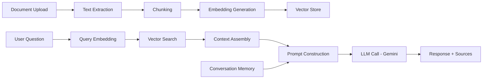

# AI Engineer Take-Home Task: Intelligent Document Q&A System

## Objective

Build an AI-powered document question-answering system. The system should allow users to upload text documents, process them into searchable chunks, generate embeddings, store them in a vector store, and answer natural language questions about the document content using a large language model (LLM) with retrieval-augmented generation (RAG).

This task is designed to assess AI engineering fundamentals and mid-level skills, including LLM integration, prompt engineering, text processing, embeddings, vector search, RAG pipeline design, evaluation, and building production-ready AI applications.

## Expected Time

**10–14 hours.**

---

## Allowed Tech Stack

Use Python as the primary language. You may use any libraries and frameworks you are comfortable with.

**Language & Framework:**
* **Python 3.10+** (Required)
* **Web Framework:** FastAPI (Preferred), Flask, or Django

**LLM Provider:**
* **Google Gemini API** (Required — an API key will be provided in `api.key`)

**Vector Store (choose one):**
* ChromaDB (Recommended for simplicity)
* FAISS
* Qdrant
* Pinecone (free tier)
* Weaviate

**Embedding Model (choose one):**
* Google Gemini Embedding (`models/text-embedding-004` or similar)
* Sentence-Transformers (local, e.g., `all-MiniLM-L6-v2`)

**Other Libraries (suggestions, not mandatory):**
* LangChain or LlamaIndex (optional — you may build from scratch)
* PyPDF2 / pdfplumber (if supporting PDF)
* tiktoken or similar for token counting

*Note: Containerization with Docker is preferred but optional.*

---

## Business Scenario

A company wants an internal tool where employees can upload policy documents, technical manuals, or knowledge-base articles and then ask questions in natural language to get accurate, sourced answers. There is no frontend required — this is an API-only service.

The system should support:
* Document upload and processing
* Intelligent chunking and embedding generation
* Natural language question answering with source attribution
* Conversation context (multi-turn Q&A)
* Answer quality controls (hallucination mitigation)

---

## Core Requirements

### 1. Document Ingestion Pipeline

Implement a pipeline that accepts documents and processes them for retrieval.

**Required Features:**
* Accept plain text (`.txt`) and Markdown (`.md`) file uploads
* Split documents into chunks using an intelligent chunking strategy
* Generate embeddings for each chunk
* Store chunks and embeddings in a vector store
* Track document metadata (filename, upload time, chunk count, total tokens)

**Rules:**
* Chunks must overlap to preserve context at boundaries. Document your chunk size and overlap settings and explain your reasoning.
* Each chunk must retain metadata: source document ID, chunk index, and the original filename.
* Duplicate document uploads (same filename) should replace the previous version, not create duplicates.
* The system must handle documents of at least 50 pages / 25,000 words without failure.
* Return a processing summary after ingestion (number of chunks, estimated tokens, processing time).

### 2. Question Answering (RAG Pipeline)

Implement a retrieval-augmented generation pipeline that answers user questions based on uploaded documents.

**Required Features:**
* Accept a natural language question
* Retrieve the most relevant chunks from the vector store
* Construct a prompt with retrieved context and the user question
* Call the Gemini LLM to generate an answer
* Return the answer along with source references (document name + chunk excerpt)

**Rules:**
* Use cosine similarity (or equivalent) for retrieval. Return the top-k most relevant chunks (make k configurable, default 5).
* The prompt sent to the LLM must instruct it to only answer based on the provided context. If the context does not contain enough information, the model should say so rather than hallucinate.
* Answers must include source citations — at minimum, the document name and a short excerpt from the chunk(s) used.
* Token usage (prompt tokens + completion tokens) must be tracked and returned in the response.
* The system must handle the case where no documents have been uploaded (return a clear message, not an error).

### 3. Conversation Memory

Implement basic multi-turn conversation support.

**Required Features:**
* Create a conversation session (returns a session ID)
* Send follow-up questions within a session that consider prior Q&A context
* List conversation history for a session
* Delete a conversation session

**Rules:**
* Conversation history must be included in the LLM prompt for follow-up questions, but managed to stay within token limits.
* Implement a strategy for handling long conversations (e.g., summarizing older turns, sliding window, or truncation). Document your chosen approach and reasoning.
* Sessions must persist across API requests (use in-memory storage or a simple database — both are acceptable).
* Each conversation turn must store: the question, answer, sources used, token count, and timestamp.

### 4. Prompt Engineering

Demonstrate deliberate, well-structured prompt design.

**Required Features:**
* Use a system prompt that defines the assistant's role, behavior, and constraints
* Use structured prompt templates that clearly separate context, instructions, and the user query
* Implement at least one prompt variation for different query types (e.g., factual lookup vs. summarization vs. comparison)

**Rules:**
* All prompts must be stored as configurable templates (not hard-coded inline strings).
* The system prompt must instruct the model to decline answering when context is insufficient (anti-hallucination).
* Document your prompt design decisions in your README: why you structured prompts the way you did, and what trade-offs you considered.

### 5. Basic Evaluation & Observability

Implement mechanisms to measure and observe the system's quality.

**Required Features:**
* Log every LLM call with: prompt (or hash), response, latency, token usage, and model used
* Implement a simple relevance scoring endpoint: given a question and the retrieved chunks, return a basic relevance score (e.g., cosine similarity between question embedding and each chunk)
* Provide an endpoint to retrieve system usage statistics: total questions asked, total tokens used, average response time, total documents indexed

**Rules:**
* Logs must be written to a file or stdout in structured format (JSON lines preferred).
* Token usage tracking must differentiate between embedding tokens and LLM generation tokens.
* The statistics endpoint must work without requiring external monitoring tools.

### 6. Validation and Error Handling

Implement proper validation and return meaningful error responses.

**Edge Case Examples to Handle:**
* Empty question or question with only whitespace
* Question asked when no documents are loaded
* Uploading an unsupported file type
* Document too large (define and enforce a reasonable limit)
* LLM API errors (rate limiting, timeout, invalid key)
* Invalid session ID for conversation endpoints
* Vector store connection failures

**Example JSON Error Response:**

    {
      "error": "ValidationError",
      "message": "Question cannot be empty"
    }

**Expected HTTP Status Codes:**

| Scenario | Status Code |
|---|---|
| Successful query | `200 OK` |
| Document uploaded successfully | `201 Created` |
| Validation error | `400 Bad Request` |
| Invalid API key / auth failure | `401 Unauthorized` |
| Resource not found (session, document) | `404 Not Found` |
| Unsupported file type | `415 Unsupported Media Type` |
| Document too large | `413 Content Too Large` |
| LLM rate limit hit | `429 Too Many Requests` |
| LLM / Vector store error | `502 Bad Gateway` |

### 7. Response Format

All API responses must follow a consistent JSON structure.

**Q&A Response:**

    {
      "data": {
        "answer": "Based on the documentation, the refund policy allows...",
        "sources": [
          {
            "document": "refund_policy.txt",
            "chunk_index": 3,
            "excerpt": "...customers may request a full refund within 30 days...",
            "relevance_score": 0.87
          }
        ],
        "conversation_id": "sess_abc123",
        "token_usage": {
          "prompt_tokens": 1250,
          "completion_tokens": 180,
          "total_tokens": 1430
        },
        "model": "gemini-2.0-flash",
        "latency_ms": 1320
      }
    }

**Error Response:**

    {
      "error": "ErrorType",
      "message": "Human-readable description"
    }

---

## API Endpoints

You may name routes differently, but the following functionality must exist:

**Documents**
* `POST /documents/upload` — Upload and process a document
* `GET /documents` — List all indexed documents with metadata
* `GET /documents/{document_id}` — Get document details (metadata, chunk count, etc.)
* `DELETE /documents/{document_id}` — Remove a document and its chunks/embeddings

**Question Answering**
* `POST /ask` — Ask a question (optionally within a conversation session)

**Conversations**
* `POST /conversations` — Create a new conversation session
* `GET /conversations/{session_id}` — Get conversation history
* `GET /conversations` — List all conversation sessions
* `DELETE /conversations/{session_id}` — Delete a conversation session

**System**
* `GET /health` — Health check (vector store connected, LLM API reachable)
* `GET /stats` — System usage statistics

---

## Architecture Overview

The solution should follow a clean pipeline architecture:

**Key Components:**
* **Document Processor** — Handles ingestion, chunking, and embedding
* **Retriever** — Searches the vector store for relevant chunks
* **Prompt Engine** — Constructs prompts from templates, context, and conversation history
* **LLM Client** — Manages Gemini API calls, retries, and error handling
* **Conversation Manager** — Tracks multi-turn sessions
* **Logger / Observer** — Records all LLM interactions and system metrics

---

## Testing Requirements

Include automated tests for the most important flows.

**Minimum Required Test Coverage:**
* Document upload and chunk creation (verify correct chunk count, metadata)
* Chunking logic (verify overlap, boundary handling)
* Question answering returns an answer with sources
* Question answering with no documents returns appropriate message
* Conversation session creation and multi-turn context
* Conversation history retrieval
* Prompt template rendering (verify variables are substituted correctly)
* Relevance scoring endpoint returns scores
* Error handling: empty question, unsupported file type, invalid session ID
* Token counting accuracy (within reasonable tolerance)
* Health check endpoint

*Note: For LLM-dependent tests, you may mock the Gemini API response. Document how to run tests with and without live API calls.*

---

## Documentation Requirements

Provide a `README` that explains:
* How to run the application (including setting the API key)
* How to run the tests (with and without live LLM calls)
* Environment variables needed
* Vector store setup instructions
* Chunking strategy and design decisions
* Prompt engineering approach and rationale
* Token management strategy
* Architecture overview (diagram welcome)
* Known limitations and future improvements
* Example API calls (curl or httpie)

---

## Bonus Features (Optional)

These are not required, but they can strengthen your submission:
* **PDF support** — Parse and chunk PDF documents
* **Hybrid search** — Combine vector similarity with keyword search (BM25)
* **Streaming responses** — Stream LLM output via SSE or WebSockets
* **Reranking** — Use a cross-encoder or LLM-based reranker to improve retrieval quality
* **Metadata filtering** — Filter retrieval by document tags or date ranges
* **Async processing** — Process large documents asynchronously with status polling
* **Automated evaluation** — Implement RAGAS-style metrics (faithfulness, answer relevancy, context precision)
* **Caching** — Cache repeated or similar questions to reduce API costs
* **Multi-modal support** — Handle images in documents using Gemini's vision capabilities
* **Authentication** — API key or JWT-based access control
* **Rate limiting** — Per-user or global rate limiting on the ask endpoint
* **Docker / Docker Compose** setup for the full stack
* **CI pipeline** with linting and tests

---

## Submission Requirements

Candidates should submit:
* Source code (clean, well-organized repository)
* README with all documentation requirements covered
* Automated tests
* Sample documents for testing (at least 2 `.txt` or `.md` files)
* `requirements.txt` or `pyproject.toml` with pinned dependencies
* Sample `.env.example` with required environment variables

---

## Evaluation Criteria

1. **RAG Pipeline Quality:** Effective chunking, retrieval accuracy, and well-constructed prompts that produce relevant, grounded answers.
2. **Prompt Engineering:** Thoughtful prompt design, proper use of system instructions, clear separation of concerns in prompts, and anti-hallucination measures.
3. **Code Quality:** Clean structure, readable code, good naming conventions, separation of concerns, and maintainability.
4. **AI Engineering Practices:** Proper token management, error handling for LLM APIs, observability/logging, and cost awareness.
5. **System Design:** Sensible architecture, clear component boundaries, and a pipeline that could scale.
6. **Testing:** Meaningful tests that cover critical paths, proper mocking of LLM calls, and edge case coverage.
7. **Documentation:** Clear explanation of design decisions, especially around chunking, prompting, and retrieval strategies.

---

## What This Task Tests

This assignment covers fundamentals to mid-level AI engineer skills, including:
* LLM API integration (Google Gemini)
* Retrieval-Augmented Generation (RAG) pipeline design
* Text chunking and embedding strategies
* Vector store usage and similarity search
* Prompt engineering and template management
* Conversation / context window management
* Token counting and cost awareness
* AI system observability and logging
* Error handling for non-deterministic AI systems
* Testing AI-powered applications
* Documentation of design decisions and trade-offs

---

## Notes for Candidates

> * Focus on building a working, well-documented RAG pipeline over adding many features.
> * The quality of your prompts, chunking strategy, and retrieval logic matters more than the number of endpoints.
> * You do not need to build a frontend.
> * You may use LangChain/LlamaIndex or build from scratch — either approach is valid. If using a framework, demonstrate that you understand what it does under the hood.
> * You may make reasonable assumptions, but please document them in your README.
> * If something is optional, it is explicitly marked as optional. Good luck!
