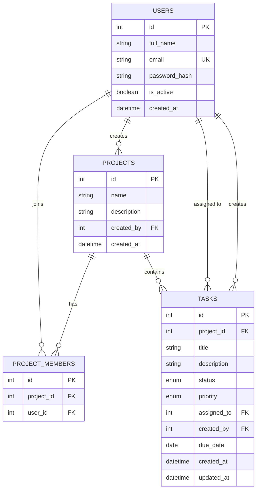

# Backend Take-Home Task: Team Task Tracker API

## Objective

Build a backend service for a small team task tracker. The system should allow users to register, log in, create projects, and manage tasks within those projects.

This task is designed to assess backend fundamentals and mid-level engineering skills, including API design, authentication, database modeling, validation, business logic, testing, and documentation.

## Expected Time

**8–12 hours.**

---

## Allowed Tech Stack
Use any backend language and framework you are comfortable with. 

**Language & Framework Examples:**
* **Python:** FastAPI, Django, Flask
* **Node.js:** Express, NestJS
* **Go:** Gin, Fiber
* **Java:** Spring Boot

**Database Requirements (Relational expected):**
* PostgreSQL (Preferred)
* MySQL (Acceptable)
* SQLite (Acceptable for simplicity)

*Note: Containerization with Docker is preferred but optional.*

---

## Business Scenario
A small company wants a simple internal task management API. There is no frontend required. 

The system should support:
* User accounts
* Project creation
* Task assignment
* Task status tracking
* Simple project-level permissions

---

## Core Requirements

### 1. Authentication
Implement user authentication.

**Required Features:**
* User registration
* User login
* Protected endpoints for authenticated users, you can use JWT to issue tokens
* Email-based account activation after registration
* Password reset via email
* Account deactivation (soft disable) and permanent deletion

**Minimum Registration Fields:**
* `full_name`
* `email`
* `password`

**Rules:**
* Email must be unique.
* Password must be stored securely (never in plain text).
* Password must be at least 8 characters long.
* Authenticated requests must use token-based auth (e.g., JWT).
* Tokens must have an expiration time. Document your chosen duration and rationale.
* Expired tokens must return a `401 Unauthorized` response.
* New accounts must be **inactive** by default. An activation token must be generated upon registration.
* Inactive accounts must not be allowed to log in. Return a clear error indicating the account is not yet activated.
* Password reset must generate a **time-limited token** (e.g., expires in 30 minutes). Users set a new password by providing the token and their new password.
* Account deactivation soft-disables the account (retains data, prevents login). A deactivated user can request reactivation via a token-based flow (similar to password reset).
* Account deletion permanently removes the user. Document how related data is handled (e.g., tasks assigned to the deleted user become unassigned, projects owned are deleted or transferred).
* Only the account owner can deactivate or delete their own account (requires authentication).
* **Note:** For this task, actual email sending is **not required**. Generate and return tokens/codes directly in the API response. In your README, briefly describe how you would integrate a real email service (e.g., SMTP, SendGrid).
* Clearly document how authentication works.

### 2. Projects
Users can create and manage projects.

**Project Fields:** `id`, `name`, `description`, `created_by`, `created_at`

**Required Features:**
* Create a project
* List projects visible to the logged-in user
* Get project details
* Update project
* Delete project

**Rules:**
* Only the project creator can update or delete the project.
* A user can only view projects they created or were added to.

### 3. Project Members
A project can have multiple members.

**Required Features:**
* Add a user to a project
* List project members
* Remove a user from a project

**Rules:**
* Only the project creator can add or remove members.
* The project creator cannot be removed from the project.
* A user cannot be added twice to the same project.

### 4. Tasks
Each project can contain multiple tasks.

**Task Fields:** `id`, `project_id`, `title`, `description`, `status`, `priority`, `assigned_to`, `created_by`, `due_date`, `created_at`, `updated_at`

**Allowed Values:**
* **status:** `todo`, `in_progress`, `done`
* **priority:** `low`, `medium`, `high`

**Required Features:**
* Create a task under a project
* List tasks for a project
* Get task details
* Update task
* Delete task

**Rules:**
* Only project members can create and view tasks in that project.
* A task can only be assigned to a user who is a member of the same project.
* Only project members can update tasks.
* Only the project creator or task creator can delete a task.
* The `updated_at` field must be automatically updated on every task modification.
* `due_date` is optional. When provided, it must be in ISO 8601 format (e.g., `2025-06-15`) and must not be in the past at the time of task creation.
* If `status` is not provided on creation, it defaults to `todo`.
* If `priority` is not provided on creation, it defaults to `medium`.

### 5. Filtering, Sorting, and Pagination
The task list endpoint must support the following:

**Filtering:**
* By `status`
* By `priority`
* By `assigned_to`

**Sorting:**
* By `created_at`
* By `due_date`
* Support `sort_order` parameter: `asc` (default) or `desc`.

**Pagination:**
* Use `page` and `page_size` **OR** `limit` and `offset`. Document the format you choose.

### 6. Validation and Error Handling
Implement proper validation and return meaningful error responses using proper HTTP status codes and JSON format.

**Edge Case Examples to Handle:**
* Invalid email format
* Missing required fields
* Duplicate email
* Project not found
* User not authorized
* Assigned user is not a project member
* Invalid status or priority value

**Example JSON Error Response:**
{
  "error": "ValidationError",
  "message": "assigned_to must be a member of the project"
}

**Expected HTTP Status Codes:**

| Scenario | Status Code |
|---|---|
| Successful creation | `201 Created` |
| Successful retrieval | `200 OK` |
| Successful update | `200 OK` |
| Successful deletion | `204 No Content` |
| Validation error | `400 Bad Request` |
| Authentication failure | `401 Unauthorized` |
| Authorization failure | `403 Forbidden` |
| Resource not found | `404 Not Found` |
| Duplicate resource (e.g., email) | `409 Conflict` |

### 7. Response Format
All API responses must follow a consistent JSON structure.

**Success Response (Single Resource):**

    {
      "data": { ... }
    }

**Success Response (List/Paginated):**

    {
      "data": [ ... ],
      "pagination": {
        "page": 1,
        "page_size": 20,
        "total_items": 45,
        "total_pages": 3
      }
    }

**Error Response:**

    {
      "error": "ErrorType",
      "message": "Human-readable description"
    }

---

## API Endpoints
You may name routes differently, but the following functionality must exist:

**Auth**
* `POST /auth/register`
* `POST /auth/login`
* `GET /auth/me`
* `POST /auth/activate` — Activate account using activation token
* `POST /auth/password-reset/request` — Request a password reset token
* `POST /auth/password-reset/confirm` — Reset password using token + new password
* `POST /auth/account/deactivate` — Deactivate own account (authenticated)
* `POST /auth/account/reactivate` — Request reactivation token for a deactivated account
* `DELETE /auth/account` — Permanently delete own account (authenticated)

**Projects**
* `POST /projects`
* `GET /projects`
* `GET /projects/{project_id}`
* `PUT /projects/{project_id}` (full update)
* `PATCH /projects/{project_id}` (partial update)
* `DELETE /projects/{project_id}`

**Project Members**
* `POST /projects/{project_id}/members`
* `GET /projects/{project_id}/members`
* `DELETE /projects/{project_id}/members/{user_id}`

**Tasks**
* `POST /projects/{project_id}/tasks`
* `GET /projects/{project_id}/tasks`
* `GET /projects/{project_id}/tasks/{task_id}`
* `PUT /projects/{project_id}/tasks/{task_id}` (full update)
* `PATCH /projects/{project_id}/tasks/{task_id}` (partial update)
* `DELETE /projects/{project_id}/tasks/{task_id}`

---

## Database Design Expectations
The solution should include appropriate models/tables for at least: `users`, `projects`, `project_members`, `tasks`. 

A relational design is expected. At minimum, relationships should be handled correctly:
* One user creates many projects.
* Many users can belong to many projects.
* One project has many tasks.
* One task may be assigned to one user.
* One user creates many tasks.

**Entity Relationship Diagram:**

---

## Testing Requirements
Include automated tests (unit, integration, or API tests) for the most important flows.

**Minimum Required Test Coverage:**
* User registration
* User login
* Account activation (valid and expired/invalid token)
* Login rejected for inactive account
* Password reset flow (request → confirm with valid token)
* Account deactivation and login rejection after deactivation
* Project creation
* Adding a member to a project
* Creating a task
* Preventing assignment to a non-member
* Filtering tasks by status
* Authorization failure on protected endpoint

---

## Documentation Requirements
Provide a `README` that explains:
* How to run the application
* How to run the tests
* Environment variables needed
* Database setup instructions
* Authentication method
* API examples or API docs link (Swagger/OpenAPI is a plus)

---

## Bonus Features (Optional)
These are not required, but they can strengthen your submission:
* Docker / Docker Compose setup
* Refresh tokens
* Soft delete
* Audit log for task updates
* Role support (e.g., owner and member)
* Search tasks by title
* CI setup
* Rate limiting on login
* Background job or email notification when a task is assigned
* Handling of concurrent updates (e.g., optimistic locking)
* **Passkey login (WebAuthn/FIDO2)** — Passwordless authentication using device-based cryptographic keys. If implemented, OTP is not needed alongside passkey.
* **OTP-based login or 2FA** — One-time password via email/authenticator app as a second factor for password-based login, or as a standalone passwordless option.

---

## Submission Requirements
Candidates should submit:
* Source code
* README
* Database migration files or schema setup instructions
* Automated tests
* Sample `.env.example` if needed

---

## Evaluation Criteria

1. **Code Quality:** Clean structure, readable and clean code, good naming conventions, and maintainability.
2. **API Design:** Sensible routes, correct HTTP methods, proper status codes, and consistent request/response formatting.
3. **Database Design:** Correct relationships, appropriate constraints, and clean schema design.
4. **Security Basics:** Password hashing, protected endpoints, and enforced authorization rules.
5. **Validation & Business Logic:** Handles edge cases correctly, protects data integrity, and returns meaningful errors.
6. **Testing:** Useful test coverage, easy-to-run tests, and verification of important business rules.
7. **Documentation:** The candidate's work can be understood without extra explanation, setup is clear, and assumptions are documented.

---

## What This Task Tests
This assignment covers basic to mid-level backend candidate skills, including:
* REST API fundamentals
* CRUD operations
* Auth and permissions
* Relational database modeling
* Input validation
* Filtering/sorting/pagination
* Testing
* Documentation
* Basic production-minded practices

---

## Notes for Candidates
> * Focus on correctness, clarity, and maintainability over overengineering.
> * You do not need to build a frontend.
> * You may make reasonable assumptions, but please document them in your README.
> * If something is optional, it is explicitly marked as optional. Good luck!